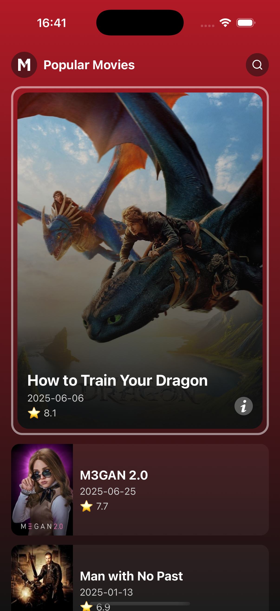
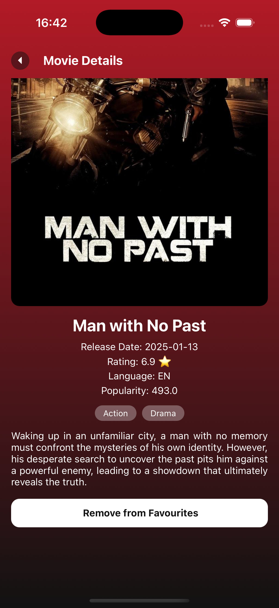
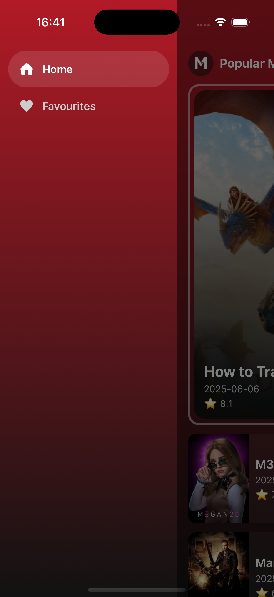
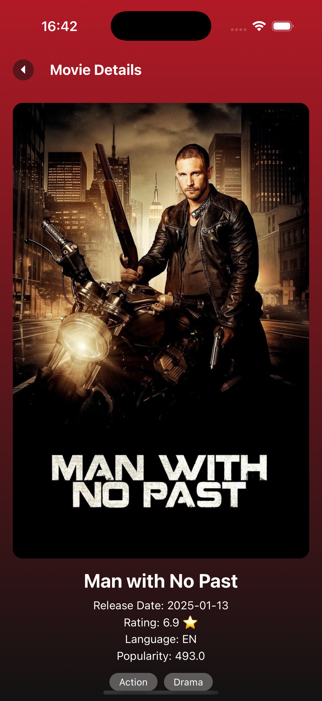
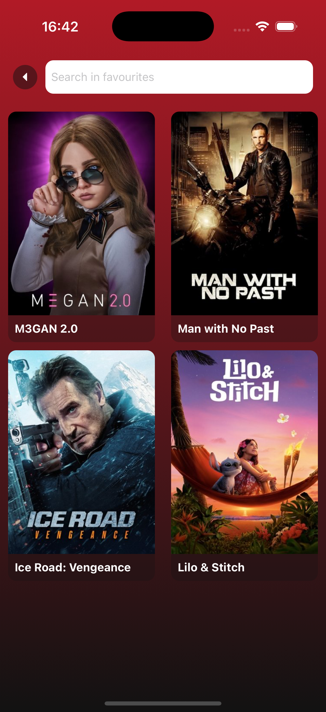

# 🎬 React Native Movie App

A beautiful and functional React Native app that displays a list of popular movies using TMDB API. Built with Redux, navigation, and persistent local storage for seamless user experience.

---

## 🚀 Features

- 📃 List of popular movies (from [TMDB](https://developer.themoviedb.org/))
- 🔍 Movie details screen
- 🧭 Drawer + Stack navigation
- 🔁 Redux with redux-persist
- ⚡ Shimmer loading UI
- 📱 Android build-ready

---

## 📸 Screenshots

| Home Screen | Movie Details |
|-------------|----------------|
|  |  |

| Drawer | Movie Details 2 |
|-------------|----------------|
|  |  |

| Favourites | Search Screen |
|-------------|----------------|
|  |  |

## 📦 Libraries Used

| Package | Purpose |
|--------|---------|
| `@react-navigation/*` | Navigation between screens |
| `@reduxjs/toolkit`, `redux`, `react-redux` | Global state management |
| `redux-persist` | Persist redux store locally |
| `axios` | API calls |
| `lodash` | Debouncing and other utilities |
| `@react-native-async-storage/async-storage` | Local storage |
| `react-native-linear-gradient` | Stylish gradients |
| `react-native-shimmer-placeholder` | Loading shimmer effect |
| `react-native-vector-icons` | UI icons |
| `react-native-system-navigation-bar` | Android nav bar color configuration

## 📥 Getting Started

### Step 1: Clone the repository
git clone https://github.com/sourraav99/Movie-Explorer.git
cd react-native-movie-app

Step 2: Install dependencies
npm install
# or
yarn install

Step 3: Start Metro
npm start
# or
yarn start

Step 4: Run Android Build
npx react-native run-android

optional 
if this npx react-native run-android
not worked run from android studio